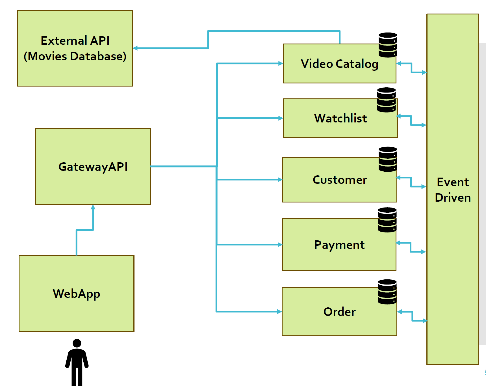

# Video Streaming System

A modern Video Streaming System designed to handle the management and playback of Movies and TV Shows. This system provides a seamless viewing experience with functionalities supported by 5 microservices and event-driven architecture.

## Features

### Microservices

1. **Customer Service**

   - User registration and login.
   - View and manage user account details and notifications.

2. **Payment Service**

   - Handle payments and maintain an audit trail of transactions.

3. **Order Service**

   - Manage video orders and provide past order details.

4. **Video Catalogue Service**

   - Fetch movie and TV show details from third-party APIs in real-time.

5. **Watchlist Service**

   - Manage the user's watchlist for Movies and TV Shows.

### Event-Driven Architecture

- Trigger notifications for new upcoming videos matching user preferences.
- Handle purchase order creation upon payment confirmation.

### Architecture Diagram



### Web Application

- User-friendly interface for interacting with microservices.
- Features for both customers (video orders, payments, watchlists) and administrators (manage upcoming titles).

### Gateway API

- Redirects and organizes communication between the web application and microservices.

### Cloud-Based Database

- Stores user accounts, notifications, orders, and payment details using solutions like Google Cloud SQL or MongoDB Atlas.

## Technologies Used

- **Frontend:** Blazor Web Assembly
- **Backend:** Microservices built with ASP.NET Core
- **Database:** MongoDB (Atlas recommended)
- **Authentication/Authorization:** JWT Tokens
- **Hosting:** Google Cloud App Engine
- **Event-driven Architecture:** Pub/Sub mechanisms
- **External APIs:** [Movies Database API](https://rapidapi.com/SAdrian/api/moviesdatabase)
- **Containerization:** Docker

## Setup Instructions

### Prerequisites

- [.NET 6 SDK](https://dotnet.microsoft.com/download/dotnet/6.0)
- [Docker](https://www.docker.com/get-started)
- [MongoDB Atlas](https://www.mongodb.com/cloud/atlas) account
- [Google Cloud Platform](https://cloud.google.com/) account

### Steps

1. **Clone the repository:**

   ```sh
   git clone <repository-url>
   cd VideoStreamingSystem
   ```

2. **Set up environment variables:**

   - Create a `.env` file in the root directory and add the necessary environment variables for MongoDB and Google Cloud credentials.

3. **Build and run the services using Docker Compose:**

   ```sh
   docker-compose up --build
   ```

4. **Access the Web Application:**

   - Open your browser and navigate to `http://localhost:80` to access the web application.

5. **Configure MongoDB Atlas:**

   - Ensure your MongoDB Atlas cluster is set up and the connection string is updated in the `appsettings.json` files of the microservices.

6. **Configure Google Cloud Pub/Sub:**
   - Ensure your Google Cloud Pub/Sub is set up and the credentials file path is updated in the `appsettings.json` files of the microservices.

### Additional Notes

- The `gateway` service uses Ocelot for API Gateway configuration.
- The `WebApp` is a Blazor WebAssembly application that interacts with the backend microservices.
- Each microservice has its own Dockerfile for containerization.
